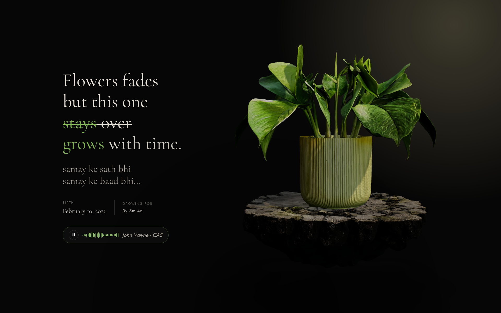

# Plant

A minimal, modern, and customizable **LightDM WebKit2** theme.

> This project is a customized fork of the original **Glorious** LightDM theme with visual and UI modifications.

<p align="center">
  
</p>

## Features

- Modern login interface
- Multi-user support
- Session selection
- Power menu
- Keyboard navigation
- Configurable appearance
- Vanilla JavaScript
- LightDM WebKit2 compatible

---

## Requirements

- `lightdm`
- `lightdm-webkit2-greeter`

---

## Installation

Clone the repository.

```bash
git clone https://github.com/samay15jan/plant.git
cd plant
```

Copy the theme.

```bash
sudo cp -r . /usr/share/lightdm-webkit/themes/plant
```

Configure LightDM to use the WebKit greeter.

```ini
# /etc/lightdm/lightdm.conf

[Seat:*]
greeter-session=lightdm-webkit2-greeter
```

Configure the WebKit greeter.

```ini
# /etc/lightdm/lightdm-webkit2-greeter.conf

webkit_theme = plant
debug_mode = true
```

Restart LightDM.

```bash
sudo systemctl restart lightdm
```

---

## Customization

You can customize the theme by editing the files inside the theme directory.

Common changes include:

- Wallpapers
- Colors
- Fonts
- Animations
- Layout
- JavaScript behavior
- 3D elements

---

## Directory

```
plant/
├── css/
├── js/
├── assets/
├── fonts/
├── index.html
└── ...
```

---

## Notes

- Wallpapers are loaded from `/usr/share/backgrounds/`.
- Set your profile picture through your desktop environment or a utility such as `mugshot`.
- Enable `debug_mode` while developing to inspect and reload the greeter.

---

## Credits

This project is based on the excellent **Glorious** LightDM WebKit2 theme by **manilarome**.

This repository contains my own modifications, UI changes, and customizations.